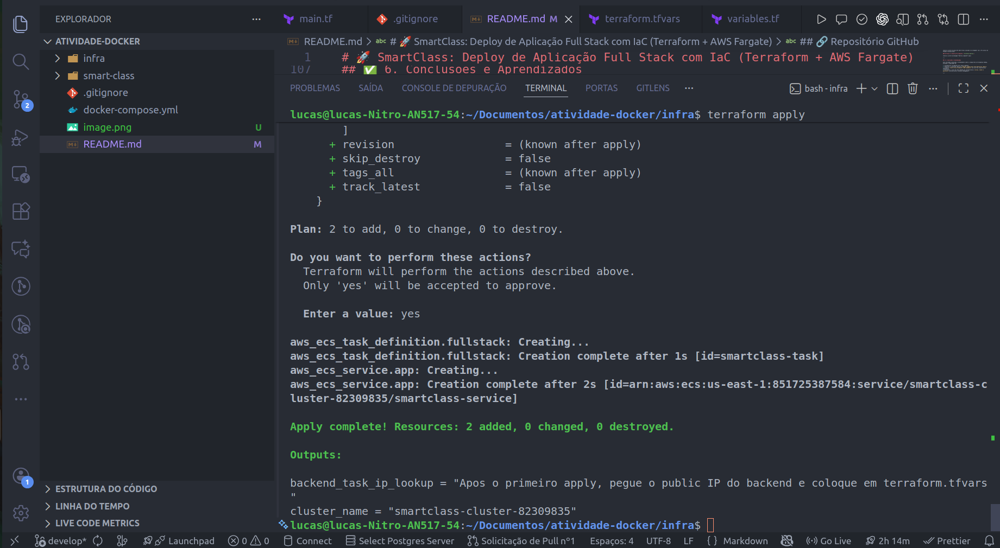
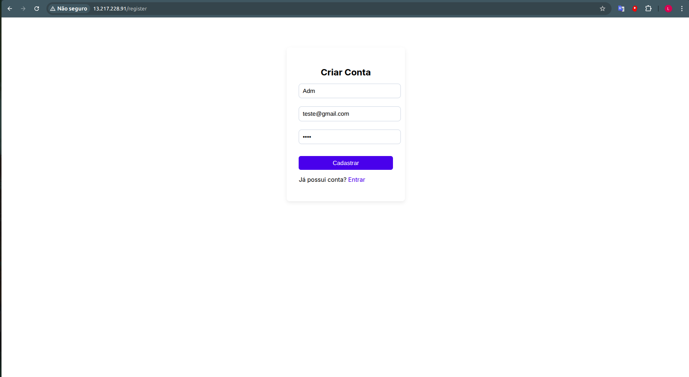
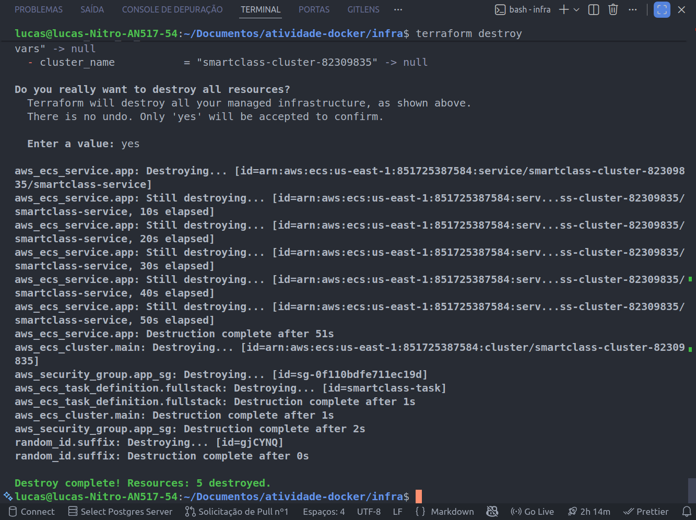

# 🚀 SmartClass: Deploy de Aplicação Full Stack com IaC (Terraform + AWS Fargate)

Este repositório documenta a atividade prática de **Infraestrutura como Código (IaC)**, onde a aplicação Full Stack **Smart-Class** foi totalmente automatizada e implantada na nuvem utilizando **Terraform** e **AWS ECS Fargate**.

O objetivo principal foi substituir configurações manuais por **código declarativo** (`.tf`), garantindo um deploy **repetível, rápido e seguro**.

---

## 🎯 1. Objetivo da Atividade

Demonstrar a competência em automação de infraestrutura, containerização e orquestração de containers em ambientes cloud-native.

| Competência Principal | Ferramentas Chave |
| :--- | :--- |
| **Infraestrutura como Código (IaC)** | Terraform 1.x |
| **Orquestração de Containers** | AWS ECS Fargate |
| **Containerização** | Docker |

---

## 🛠️ 2. Detalhes Técnicos e Pré-requisitos

### Aplicação Base

O projeto Smart-Class é uma solução **Full Stack** composta por:

* **Frontend**: Vite + React (servido via Nginx)
* **Backend**: Node.js + Express + Prisma
* **Banco de Dados**: PostgreSQL

> **Ambiente Local**: Totalmente funcional via `docker-compose up`.

### Ambiente de Execução

* **Provedor Cloud**: AWS Academy Learner Lab (Região `us-east-1`)
* **Ferramentas**: AWS CLI, Docker/Docker Hub, VSCode.

---

## 📐 3. Arquitetura da Solução (ECS Fargate)

Devido às restrições do ambiente AWS Academy (que bloqueia o uso direto de RDS e `iam:PassRole`), uma arquitetura consolidada foi adotada para a Task Definition:

### ✅ Task Definition Única (Monotask)

Uma única **Task Definition ECS Fargate** que agrupa **três (3) containers**:

1.  **`db`** (PostgreSQL)
2.  **`backend`** (Node.js)
3.  **`frontend`** (Nginx)

**Benefício**: Esta configuração permite que o **Backend** se comunique com o **DB** via `localhost:5432`, garantindo que o ambiente seja funcional e estável sem a necessidade de serviços externos bloqueados. O **Frontend** acessa o **Backend** diretamente pelo IP público atribuído à Task.

---

## 📦 4. A Jornada IaC — Processo de Deploy

### Etapa A — Preparação dos Containers

* **Build da Aplicação**: Backend e Frontend buildados localmente.
* **Push das Imagens**: Imagens publicadas no **Docker Hub** para acesso pelo Fargate.
    * `garcia3glxy/smartclass-backend:latest`
    * `garcia3glxy/smartclass-frontend:latest`

### Etapa B — Infraestrutura como Código (`main.tf`)

O **Terraform** provisionou os seguintes componentes de forma declarativa:

* **Provider AWS**: Configurado para `us-east-1`.
* **Data Sources**: Identificação automática da **VPC padrão** e **Subnets** disponíveis (evitando hardcodes no ambiente de laboratório).
* **Cluster ECS**: Criação do recurso `aws_ecs_cluster` para orquestração Fargate.
* **Security Group**: Liberando o tráfego de entrada (**TCP: 0-65535**) e egresso total para permitir o pull do Docker Hub e a comunicação interna/externa da aplicação.
* **Task Definition**: Conversão da lógica **Docker Compose** para o formato `container_definitions` do ECS (**3 containers em 1 Task**).
* **Serviço ECS**: Configuração do `aws_ecs_service` para usar Fargate, atribuir **IP público** (`assign_public_ip = true`) e rodar a Task Definition criada.

### Etapa C — Ciclo de Vida do Terraform

O deploy seguiu um ciclo de duas execuções de `apply` para injetar o IP público da API no Frontend:

| Comando | Descrição |
| :--- | :--- |
| `terraform init` | Inicializa o ambiente e baixa os providers. |
| `terraform apply` (**1ª Vez**) | Cria o Cluster, SG, Task Definition e Service. **Obtém o IP público inicial do Backend.** |
| **Ação Manual** | Inserção do `backend_public_ip` (ex: "XX.XX.XX.XX") no `terraform.tfvars`. |
| `terraform apply` (**2ª Vez**) | **Atualiza a Task do Frontend** com o IP correto do Backend. |
| `terraform destroy` | Destrói toda a infraestrutura provisionada. |

---

## 🖼️ 5. Prints Obrigatórios (Documentação)

### 📍 Print 1 — Resultado do `terraform apply`

(Insira o print da mensagem "Apply complete" aqui)

### 📍 Print 2 — Aplicação Rodando

(Insira o print da aplicação Smart-Class acessada via navegador com o IP público do Fargate Frontend aqui)

### 📍 Print 3 — Destruição Completa (`terraform destroy`)

(Insira o print da mensagem "Destroy complete" aqui)

---

## ✅ 6. Conclusões e Aprendizados

Esta atividade consolidou o entendimento sobre a integração de ferramentas DevOps, provando a capacidade de:

* ✅ Automatizar um ambiente Full Stack complexo.
* ✅ Realizar a conversão lógica de **Docker Compose para Task Definition (ECS)**.
* ✅ Superar **restrições de ambiente (AWS Academy)** com soluções arquiteturais adaptativas.
* ✅ Gerenciar o ciclo de vida completo da infraestrutura: **criar, testar e destruir** (Infrastructure Lifecycle Management).

---
---
## 🖼️ 5. Prints Obrigatórios (Documentação)

### 📍 Print 1 — Resultado do terraform apply

### 📍 Print 2 — Aplicação Rodando

### 📍 Print 3 — Destruição Completa (terraform destroy)

---

## 🔗 Repositório GitHub

O código-fonte completo da IaC e da aplicação está disponível em:
[https://github.com/LucasGarkDev/Deploy-de-Aplica-o-Full-Stack-com-IaC](https://github.com/LucasGarkDev/Deploy-de-Aplica-o-Full-Stack-com-IaC)

